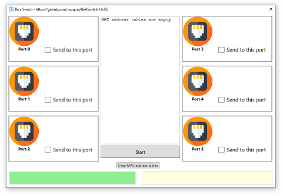
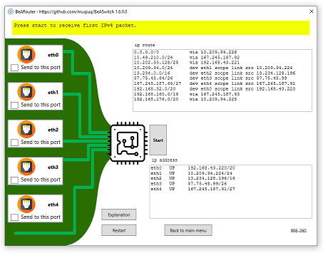
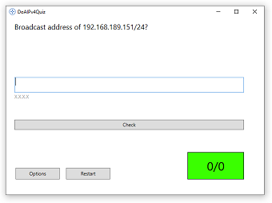

# Network Learning Toolkit - BeASwitch, BeARouter and IPQuiz

Understanding the basic concepts of an Ethernet switch can be challenging in the beginning. All the new technical terms, IEEE industry standards names and CLI configuration can easily overwhelm a young networker. 

This application is a draft for a concept where the user learns how a switch works by making the switching and routing decisions himself. 
The user is prompted one Ethernet frame (or ip packet) after another. For each of those he decides on which ports the frames/packets should be sent. He learns by try-and-error. 
If she is able to "think like a switch," she is probably able to understand switching. 

Feel free to use this application for your class or self-studying. 

Feedback is welcome!  

## BeASwitch

Simulates switching with or without VLAN. 

## BeARouter

*You want to understand routing? How about being a router for once and trying to do its job?*

Simulates a single router with multiple subnets connected. 

Each instance computes a new network with different subnets and a slightly different topology.

## IPQuiz

*Need to practice all common IPv4 and IPv6 calculations? IP Quiz helps you with unlimited set of randomly generated questions.*

IPQuiz contains 8 different typical IP subnetting problems. Each question is randomly generated. 

## Concept

The original concept aimed to map all processing steps in a home router into a 2D world (view: view from above into a transparent router). The user can zoom into the individual areas of the device and observe the computational steps. He can also take over the processes himself and carry out the individual steps manually. The entire application is designed as a multi-level game. The player has to observe automatic processes and pass on the findings (puzzles), step in as a "processor" for individual processing steps or correct incorrect configurations.

## Exercise description

See [manual](manual).

## Certificate of achievement (SuccessCertificate) feature

If you have successfully mastered an exercise and achieved the set goal, you will receive a certificate of achievement (SuccessCertificate) that you can send or present to your teacher. Please note that you can only use this feature if you're a student at the Technische Berufsschule Zürich https://tbz.ch/. 

Information for teachers at other schools who wish to use automatic submission:
- Contact me at info@uisa.ch to use my existing infrastructure.
- Clone and create your own version

## About me

I'm a teacher at [Technische Berufsschule Zürich - TBZ](https://tbz.ch/) and I like to develop learning tools for my students. Feel free to contact me: info@uisa.ch

## License
 This work is licensed under a <a rel="license" href="http://creativecommons.org/licenses/by-nc-sa/4.0/">Creative Commons Attribution-NonCommercial-ShareAlike 4.0 International License</a>.
