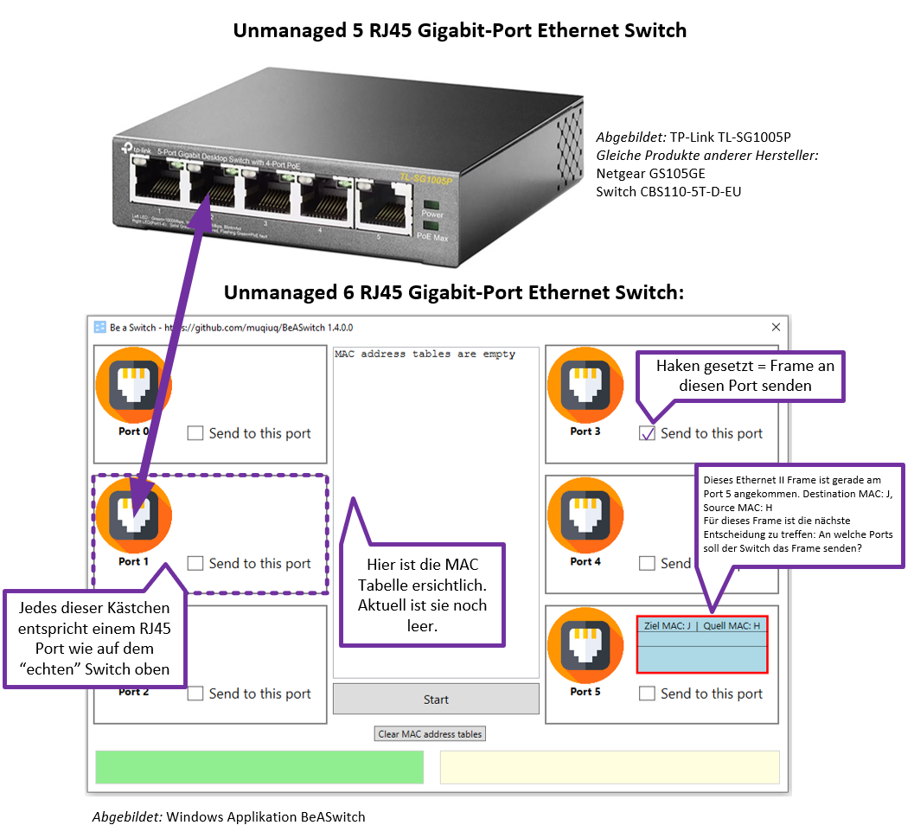

# Exercise 1: BeASwitch

A Switch (*formerly Switching Hubs*) refers to a coupling element in computer networks that interconnects network segments. A switch usually operates on OSI layer 2. It ensures within a segment (broadcast domain) that the data packets (so-called "frames") reach their destination. [*Amended* from Wikipedia][1]

With the **BeASwitch** learning program, the student takes on the role of the microchip within a switch. The premise of the exercise is that if students are able to make the switching decisions, they also understand the underlying logic of an Ethernet switch. 

**Tip for quick learning success:** Start right away with the tutorial and understand switching in a fun way.

## Steps
 - Download the latest version of the application *BeASwitch* from https://github.com/muqiuq/BeASwitch/releases.
 - Start the EXE (application is not signed and Windows gives a corresponding warning message) **You may still need to install .NET Core 6**.
 - Play through the application until you run out of errors. 

**Note: Play with BeASwitch as if it were a puzzle. You don't need any special IT knowledge to figure out how the application works.**

## Didactic consideration
 - Through observation, the student recognizes the logic of the basic functionality of a switch: forwarding frames using the *Destination MAC*, *Source MAC*, and *MAC* table. 
 - The student tests his/her understanding of the switching logic by making decisions for frames arriving at the switch and then using the program to verify that the result of his/her reasoning is correct. 

 - [1]: https://de.wikipedia.org/wiki/Switch_(Netzwerktechnik) "Wikipedia DE"