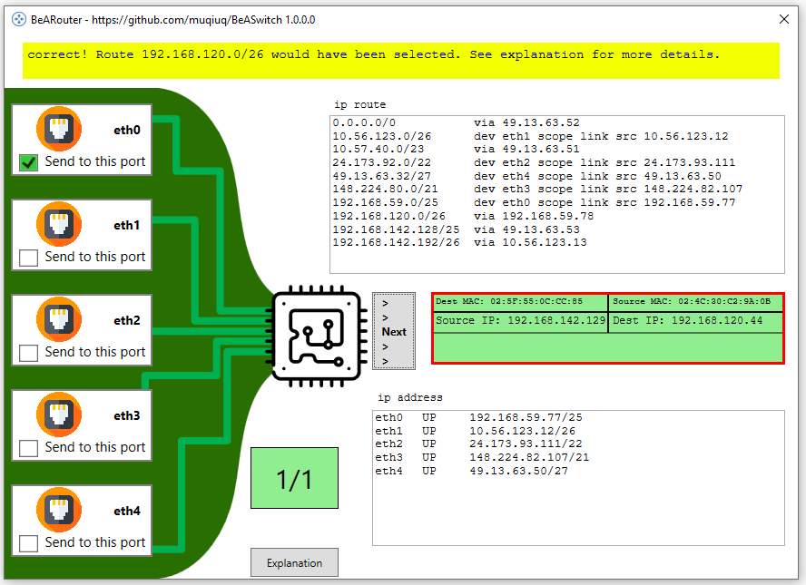
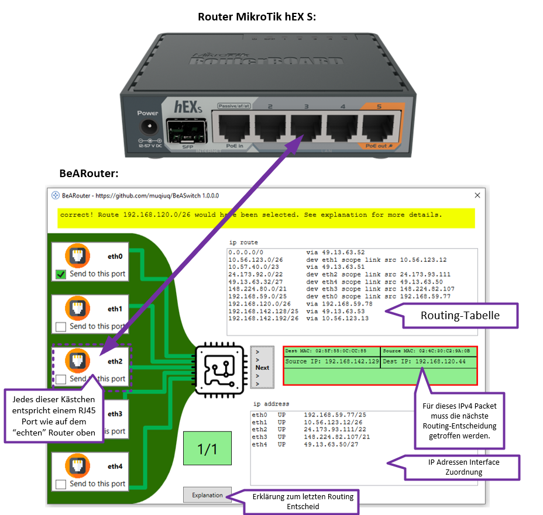

# Exercise 2: BeARouter

**BeARouter** learning program corresponds in principle to the previous BeARouter exercise. Instead of making switching decisions, IPv4 routing decisions are now to be made. 

**Tip for quick learning success:** Start right away with the tutorial and understand routing in a fun way.

# Steps
 - Download from https://github.com/muqiuq/BeASwitch/releases the version latest version of the application *BeARouter*.
 - Start the EXE (application is not signed and must be trusted manually!) **You may still need to install .NET Core 6.**.
 - Play through the application until you run out of errors. 

