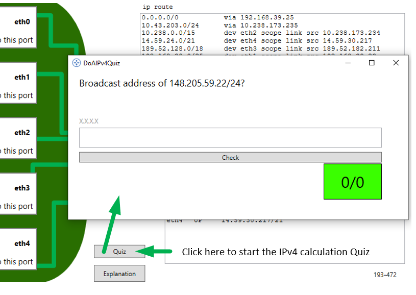

# Exercise 3: IPv4 Quiz

To configure IP protocols correctly on routers, you need to master the most important IPv4 and IPv6 calculations:
 - IPv4: Calculate broadcast address of a subnet
 - IPv4: Calculate network address of a subnet
 - IPv4: Calculate number of possible host address of a subnet
 - IPv4: Subnet mask conversion from prefix (ex: "/24") to decimal (ex: 255.255.255.0) (and vice versa)
 - IPV4: Split a given subnet into further subnets. 
 - IPv6: Calcualte EUI64 address for existing ::/64 prefix
 - IPv6: Expand and abbreviate address
 - IPv6: Know most used IPv6 prefixes

All IPv4 tasks can be solved with the [*Visual Subnet Calculator*](https://www.davidc.net/sites/default/subnets/subnets.html). 

Related Content: https://gitlab.com/ch-tbz-it/Stud/m129/-/blob/main/50_IPv4/README.md

# Steps
 - **Prerequisite:** The BeARouter application from Exercise 2 is installed and functioning on your PC. 
 - After starting the application, the *Quiz* button is available. Clicking this button will start the *DoAIPv4Quiz* application. 
 - *Note:* The button is only visible directly after starting the application!

